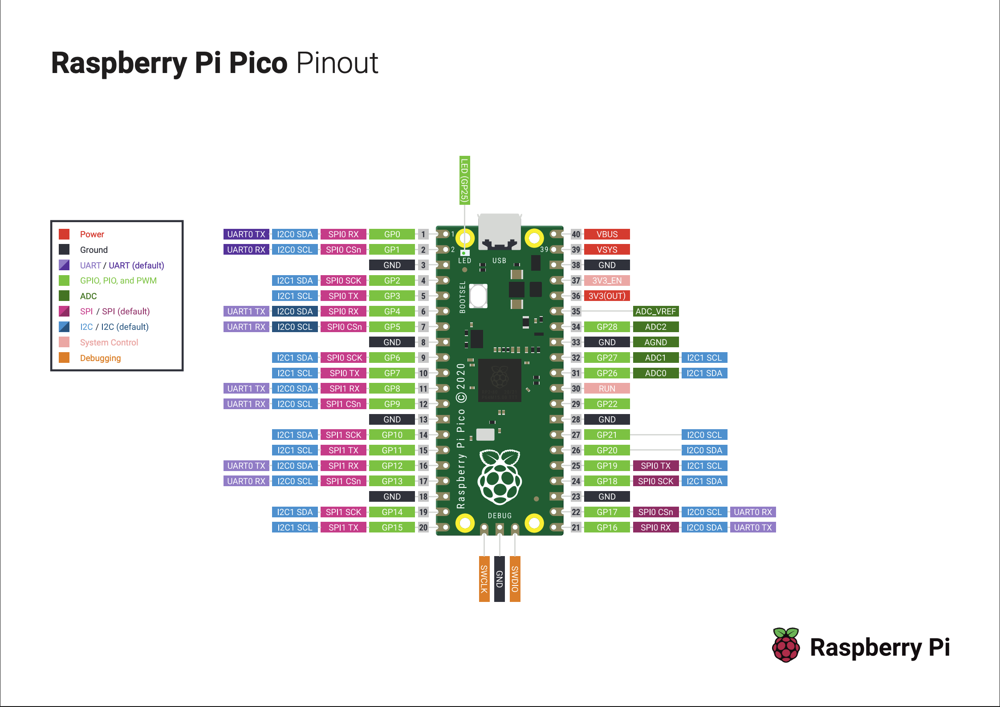
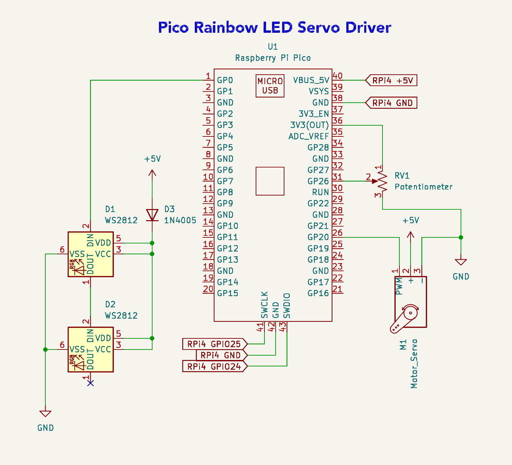

# Pico Rainbow Servo Dial


A potentiometer-driven analog gauge built on the Raspberry Pi Pico (RP2040) using the Raspberry Pi Pico C/C++ SDK. Turning the dial sweeps a servo through its full range and cycles a pair of chained WS2812 (NeoPixel) LEDs through a 7-color rainbow, giving a live visual + mechanical readout of the same analog signal.

## Demo

https://github.com/user-attachments/assets/435a197b-8467-42c9-82a6-d279dda730db


## How It Works

The potentiometer feeds an analog voltage into the Pico's ADC (0–4095 raw reading). That single reading is mapped to two outputs simultaneously, refreshed every 40ms:

1. **Servo position** — linearly mapped from the ADC range to 0–100% of the servo's travel.
2. **NeoPixel color** — the ADC range is split into 7 even bands, one per rainbow color, so the two chained NeoPixels shift color as you turn the dial.

| ADC Range | Color |
|:---:|:---:|
| 0 – 585 | Red |
| 586 – 1170 | Orange |
| 1171 – 1755 | Yellow |
| 1756 – 2340 | Green |
| 2341 – 2925 | Blue |
| 2926 – 3510 | Indigo |
| 3511 – 4095 | Purple |

## Hardware

### Raspberry Pi Pico Pinout



Built and wired against the schematic below.



| Component | GPIO |
|---|:---:|
| Potentiometer (ADC wiper) | 26 (ADC0) |
| Servo signal (PWM) | 20 |
| NeoPixel data (DIN) | 0 |

The potentiometer runs off the Pico's onboard 3.3V rail (pin 36) to stay within the ADC's safe input range, while the servo and NeoPixels run off a separate 5V rail. The NeoPixels' 5V supply passes through a series diode first, dropping it to about 4.3–4.4V — since the RP2040's data line is 3.3V logic, this brings the signal closer to a reliable logic HIGH relative to the LEDs' VDD without needing a dedicated level shifter.

This build is powered and flashed entirely from a Raspberry Pi 4: 5V/GND from the Pi feed the Pico's VBUS/GND pins, and the Pi's GPIO24/GPIO25 connect to the Pico's SWCLK/SWDIO debug pins for flashing over SWD instead of the usual BOOTSEL/USB drag-and-drop.

## Building & Flashing

**Requirements:** [Raspberry Pi Pico C/C++ SDK](https://github.com/raspberrypi/pico-sdk), CMake, and an ARM GCC embedded toolchain (`arm-none-eabi-gcc`). Set the `PICO_SDK_PATH` environment variable to point at your SDK checkout.

Easiest path: open this repo in VS Code with the [CMake Tools](https://marketplace.visualstudio.com/items?itemName=ms-vscode.cmake-tools) extension installed, then run **CMake: Build** — it handles the configure and compile for you.

Manual build:

```bash
git clone https://github.com/olael94/pico-rainbow-servo-dial.git
cd pico-rainbow-servo-dial
mkdir build && cd build
cmake ..
make
```

## Project Structure 
```bash
RBServo.c                       — ADC read, servo PWM, and NeoPixel color logic
CMakeLists.txt                  — build configuration
pico_sdk_import.cmake           — pulls in the Pico SDK
ws2812.pio                      — PIO program driving the NeoPixels
RB-Rainbow-Servo-Schematic.png  — circuit schematic
RaspberryPi-Pico-Pinout.png     — Pico pinout reference
```
